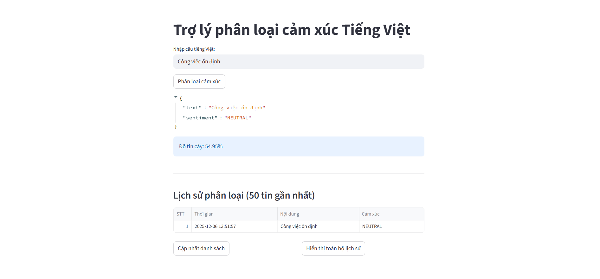

# 🧠 Trợ lý Phân loại Cảm xúc Tiếng Việt (Vietnamese Sentiment Analysis)

[](https://streamlit.io)
[](https://www.python.org/)
[](https://huggingface.co/wonrax/phobert-base-vietnamese-sentiment)

Ứng dụng web được xây dựng bằng **Streamlit**, sử dụng mô hình **PhoBERT** để phân tích và phân loại cảm xúc của các câu văn Tiếng Việt thành 3 nhãn: **Tích cực (Positive)**, **Tiêu cực (Negative)**, hoặc **Trung tính (Neutral)**.




---

## 🚀 Tính năng chính

-   **Phân loại cảm xúc:** Nhận diện chính xác cảm xúc của câu văn tiếng Việt.
-   **Tự động xử lý Teencode:** Hỗ trợ chuẩn hóa các từ viết tắt phổ biến (ví dụ: "ko" → "không", "fải" → "phải").
-   **Độ tin cậy (Confidence Score):** Hiển thị % độ chắc chắn của mô hình đối với kết quả dự đoán.
-   **Lịch sử hoạt động:**
    -   Lưu trữ kết quả phân loại vào cơ sở dữ liệu SQLite cục bộ (`history.db`).
    -   Xem lại 50 lượt phân tích gần nhất hoặc toàn bộ lịch sử.
-   **Kiểm soát đầu vào:** Tự động lọc các câu quá ngắn (< 5 ký tự) hoặc quá dài (> 50 từ).

---

## 🛠 Cài đặt & Chạy Local

Để chạy ứng dụng trên máy cá nhân, hãy làm theo các bước sau:

### 1. Clone dự án

```bash
git clone https://github.com/MinhTriTech/VietnameseSentimentApp.git
cd repo-name
```

### 2. Tạo môi trường ảo:

```bash
python -m venv venv

# Linux / Mac
source venv/bin/activate
# Windows
venv\Scripts\activate
```

### 3. Cài đặt dependencies:

```bash
pip install -r requirements.txt
```

---

### Chạy ứng dụng
```bash
streamlit run app.py
```

-   Nhập câu tiếng Việt vào ô text input
-   Nhấn **Phân loại cảm xúc**
-   Xem kết quả và lưu vào lịch sử

---

### Cấu trúc project
```pgsql
project/
│
├─ app.py          # Streamlit UI
├─ db.py           # Database functions
├─ model.py        # Load model & xử lý text
├─ requirements.txt
└─ .gitignore
```

---

### Dependencies chính

-   Python 3.8 +
-   streamlit
-   transformers
-   pandas
-   sqlite3 (built-in)

---

### Ghi chú

-   Mô hình PhoBERT được tải tự động lần đầu tiên khi chạy app
-   Câu quá ngắn (<5 ký tự) hoặc quá dài (>50 ký tự) sẽ không phân loại
-   Lịch sử phân loại được lưu local trong history.db
