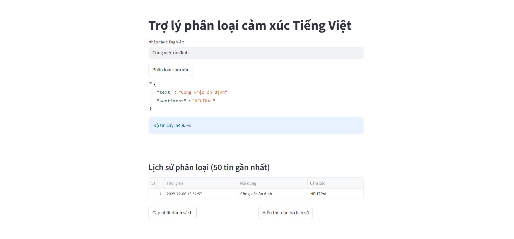

# 🧠 Trợ lý Phân loại Cảm xúc Tiếng Việt

[](https://streamlit.io)
[](https://www.python.org/)
[](https://huggingface.co/wonrax/phobert-base-vietnamese-sentiment)
[](LICENSE)

Ứng dụng web phân tích cảm xúc văn bản tiếng Việt, được xây dựng bằng **Streamlit** và mô hình ngôn ngữ lớn **PhoBERT**. Hệ thống phân loại câu văn tiếng Việt thành ba nhãn cảm xúc: **Tích cực (POSITIVE)**, **Tiêu cực (NEGATIVE)**, hoặc **Trung tính (NEUTRAL)**, kèm theo điểm độ tin cậy của dự đoán.



---

## 📋 Mục lục

- [Tổng quan](#-tổng-quan)
- [Tính năng chính](#-tính-năng-chính)
- [Kiến trúc hệ thống](#-kiến-trúc-hệ-thống)
- [Mô hình & Xử lý văn bản](#-mô-hình--xử-lý-văn-bản)
- [Cơ sở dữ liệu](#-cơ-sở-dữ-liệu)
- [Cài đặt & Chạy Local](#-cài-đặt--chạy-local)
- [Hướng dẫn sử dụng](#-hướng-dẫn-sử-dụng)
- [Cấu trúc dự án](#-cấu-trúc-dự-án)
- [Danh sách thư viện](#-danh-sách-thư-viện)
- [Giới hạn & Lưu ý](#-giới-hạn--lưu-ý)

---

## 🌟 Tổng quan

Dự án này giải quyết bài toán **phân tích cảm xúc (Sentiment Analysis)** cho văn bản tiếng Việt — một thách thức đặc thù do sự phong phú của ngôn ngữ Việt, bao gồm các từ viết tắt (teencode), từ địa phương và cấu trúc ngữ pháp khác biệt.

Ứng dụng sử dụng mô hình **[wonrax/phobert-base-vietnamese-sentiment](https://huggingface.co/wonrax/phobert-base-vietnamese-sentiment)** — một biến thể của PhoBERT được fine-tune cho bài toán phân tích cảm xúc tiếng Việt — kết hợp với pipeline tiền xử lý ngôn ngữ để cho kết quả chính xác và đáng tin cậy.

---

## 🚀 Tính năng chính

| Tính năng | Mô tả |
|---|---|
| **Phân loại cảm xúc** | Nhận diện cảm xúc câu văn tiếng Việt thành 3 nhãn: POSITIVE, NEGATIVE, NEUTRAL |
| **Xử lý Teencode** | Tự động chuẩn hóa từ viết tắt phổ biến (ví dụ: `ko` → `không`, `dc` → `được`, `bt` → `bình thường`) |
| **Tách từ tiếng Việt** | Sử dụng thư viện `underthesea` để tách từ (word tokenize) chính xác trước khi đưa vào mô hình |
| **Điểm độ tin cậy** | Hiển thị phần trăm độ chắc chắn (Confidence Score) của dự đoán |
| **Lịch sử phân tích** | Lưu toàn bộ kết quả vào cơ sở dữ liệu SQLite cục bộ, xem lại 50 lượt gần nhất hoặc toàn bộ |
| **Kiểm tra đầu vào** | Từ chối văn bản quá ngắn (< 5 ký tự) hoặc quá dài (> 50 ký tự) kèm thông báo lỗi rõ ràng |
| **Giao diện trực quan** | Giao diện web thân thiện với Streamlit, hỗ trợ hiển thị bảng lịch sử tương tác |

---

## 🏗 Kiến trúc hệ thống

```
Người dùng nhập văn bản
        │
        ▼
┌─────────────────────┐
│  app.py (Giao diện) │  ◄── Streamlit UI
│  - Nhận đầu vào     │
│  - Hiển thị kết quả │
│  - Quản lý lịch sử  │
└────────┬────────────┘
         │
    ┌────┴────┐
    │         │
    ▼         ▼
┌────────┐ ┌────────┐
│model.py│ │  db.py │
│        │ │        │
│Tiền xử │ │ SQLite │
│lý văn  │ │history │
│bản +   │ │  .db   │
│PhoBERT │ │        │
└────────┘ └────────┘
```

Luồng xử lý của một yêu cầu phân loại:

1. **Nhận đầu vào** — `app.py` nhận chuỗi văn bản từ người dùng.
2. **Kiểm tra độ dài** — Loại bỏ câu < 5 ký tự hoặc > 50 ký tự.
3. **Tiền xử lý** (`model.py`) — Chuyển chữ thường, thay thế teencode, tách từ với `underthesea`.
4. **Phân loại** (`model.py`) — Đưa văn bản đã xử lý qua mô hình PhoBERT, nhận nhãn và điểm tin cậy.
5. **Lưu kết quả** (`db.py`) — Ghi kết quả vào bảng `sentiments` trong SQLite.
6. **Hiển thị** (`app.py`) — Trả về nhãn, điểm tin cậy và cập nhật bảng lịch sử.

---

## 🤖 Mô hình & Xử lý văn bản

### Mô hình PhoBERT

Mô hình sử dụng là **[wonrax/phobert-base-vietnamese-sentiment](https://huggingface.co/wonrax/phobert-base-vietnamese-sentiment)**, được xây dựng dựa trên kiến trúc PhoBERT (BERT được pre-train trên kho ngữ liệu tiếng Việt lớn) và fine-tune cho bài toán phân tích cảm xúc.

- **Đầu ra của mô hình:** Nhãn `POS` (tích cực), `NEG` (tiêu cực), `NEU` (trung tính) kèm điểm xác suất.
- **Ánh xạ nhãn:** `POS` → `POSITIVE`, `NEG` → `NEGATIVE`, `NEU` → `NEUTRAL`.
- **Ngưỡng tin cậy:** Nếu điểm xác suất < 0.5, nhãn được chuyển thành `NEUTRAL` để tránh dự đoán sai.
- **Cache mô hình:** Sử dụng `@st.cache_resource` để chỉ tải mô hình một lần duy nhất khi khởi động, tránh tải lại mỗi lần người dùng tương tác.

### Pipeline tiền xử lý văn bản

```
Văn bản gốc
    │
    ├── Kiểm tra độ dài (5 ≤ len ≤ 50 ký tự)
    │
    ├── Chuyển toàn bộ sang chữ thường
    │
    ├── Chuẩn hóa Teencode (tra từ điển TEENCODE_DICT)
    │   Ví dụ: "ko" → "không", "dc" → "được", "bt" → "bình thường"
    │
    └── Tách từ tiếng Việt (underthesea word_tokenize)
            │
            ▼
      Văn bản đã xử lý → PhoBERT
```

### Từ điển Teencode hỗ trợ

| Teencode | Từ chuẩn |
|---|---|
| `ko`, `k` | `không` |
| `dc` | `được` |
| `bt` | `bình thường` |
| `ok`, `tot` | `tốt` |
| `dep` | `đẹp` |
| `bun` | `buồn` |
| `wa` | `quá` |
| `ng` | `người` |
| `rat` | `rất` |
| `hnay` | `hôm nay` |

---

## 🗄 Cơ sở dữ liệu

Ứng dụng sử dụng **SQLite** — cơ sở dữ liệu nhúng, không cần cài đặt server — lưu trữ trong file `history.db` tại thư mục gốc của dự án.

### Cấu trúc bảng `sentiments`

| Cột | Kiểu dữ liệu | Mô tả |
|---|---|---|
| `id` | INTEGER PRIMARY KEY AUTOINCREMENT | Khóa chính, tự tăng |
| `text` | TEXT | Văn bản gốc người dùng nhập |
| `sentiment` | TEXT | Nhãn cảm xúc: POSITIVE / NEGATIVE / NEUTRAL |
| `timestamp` | TEXT | Thời điểm phân loại (định dạng `YYYY-MM-DD HH:MM:SS`) |

### Các hàm thao tác cơ sở dữ liệu (`db.py`)

- **`init_db()`** — Khởi tạo kết nối và tạo bảng `sentiments` nếu chưa tồn tại.
- **`save_to_db(text, sentiment)`** — Lưu một kết quả phân loại mới vào DB. Sử dụng **Parameterized Query** (`?`) để chống SQL Injection.
- **`load_history(limit=50)`** — Lấy 50 bản ghi gần nhất, sắp xếp theo thứ tự thời gian giảm dần.
- **`load_history_all()`** — Lấy toàn bộ lịch sử, sắp xếp theo thứ tự thời gian giảm dần.

---

## 🛠 Cài đặt & Chạy Local

### Yêu cầu hệ thống

- Python **3.8** trở lên
- pip (trình quản lý gói Python)
- Kết nối Internet (để tải mô hình PhoBERT lần đầu tiên, khoảng ~500 MB)

### Bước 1: Clone dự án

```bash
git clone https://github.com/MinhTriTech/VietnameseSentimentApp.git
cd VietnameseSentimentApp
```

### Bước 2: Tạo môi trường ảo (khuyến nghị)

Sử dụng môi trường ảo để tránh xung đột giữa các phiên bản thư viện:

```bash
python -m venv venv

# Kích hoạt trên Linux / macOS
source venv/bin/activate

# Kích hoạt trên Windows
venv\Scripts\activate
```

### Bước 3: Cài đặt các thư viện phụ thuộc

```bash
pip install -r requirements.txt
```

> ⏳ Quá trình cài đặt có thể mất vài phút do cần tải PyTorch và Transformers.

### Bước 4: Khởi chạy ứng dụng

```bash
streamlit run app.py
```

Ứng dụng sẽ tự động mở trình duyệt tại địa chỉ `http://localhost:8501`.

> 💡 Lần đầu chạy, mô hình PhoBERT (~500 MB) sẽ được tải xuống tự động từ Hugging Face. Các lần sau sẽ được tải từ cache cục bộ.

---

## 📖 Hướng dẫn sử dụng

### Phân loại cảm xúc

1. Nhập câu tiếng Việt vào ô **"Nhập câu tiếng Việt:"**  
   *Ví dụ: "Hôm nay tôi rất vui vì được đi chơi"*
2. Nhấn nút **"Phân loại cảm xúc"**.
3. Kết quả hiển thị gồm:
   - **Nhãn cảm xúc:** `POSITIVE`, `NEGATIVE`, hoặc `NEUTRAL`
   - **Độ tin cậy:** phần trăm chắc chắn của mô hình (ví dụ: `Độ tin cậy: 97.45%`)
4. Kết quả tự động được lưu vào lịch sử.

### Xem và quản lý lịch sử

- **Bảng lịch sử** phía dưới hiển thị 50 lượt phân tích gần nhất với các cột: STT, Thời gian, Nội dung, Cảm xúc.
- Nhấn **"Cập nhật danh sách"** để làm mới bảng lịch sử.
- Nhấn **"Hiển thị toàn bộ lịch sử"** để xem tất cả các lượt đã phân tích từ trước đến nay.

---

## 📁 Cấu trúc dự án

```
VietnameseSentimentApp/
│
├── app.py              # Giao diện Streamlit chính
│                       # Xử lý tương tác người dùng, điều phối model và DB
│
├── model.py            # Logic mô hình AI
│                       # - Tải và cache PhoBERT
│                       # - Từ điển Teencode
│                       # - Tiền xử lý văn bản (lowercase, teencode, tokenize)
│                       # - Hàm phân loại cảm xúc
│
├── db.py               # Thao tác cơ sở dữ liệu SQLite
│                       # - Khởi tạo DB & bảng
│                       # - Lưu và truy vấn lịch sử phân loại
│
├── requirements.txt    # Danh sách thư viện và phiên bản cố định
│
├── images/
│   └── HomePage.png    # Ảnh minh họa giao diện ứng dụng
│
├── history.db          # File SQLite lưu lịch sử (tự tạo khi chạy lần đầu)
│
└── .gitignore          # Bỏ qua các file không cần theo dõi (venv, cache, DB, ...)
```

---

## 📦 Danh sách thư viện

| Thư viện | Phiên bản | Vai trò |
|---|---|---|
| `streamlit` | 1.51.0 | Framework giao diện web |
| `transformers` | 4.57.3 | Tải và chạy mô hình PhoBERT từ Hugging Face |
| `torch` | 2.9.1 | Backend deep learning cho Transformers |
| `underthesea` | 8.3.0 | Tách từ (word tokenize) tiếng Việt |
| `pandas` | 2.3.3 | Quản lý và hiển thị dữ liệu lịch sử dạng bảng |
| `sqlite3` | built-in | Cơ sở dữ liệu nhúng (có sẵn trong Python) |

---

## ⚠️ Giới hạn & Lưu ý

- **Độ dài đầu vào:** Chỉ hỗ trợ văn bản từ **5 đến 50 ký tự**. Văn bản ngắn hơn hoặc dài hơn sẽ bị từ chối với thông báo lỗi rõ ràng.
- **Tải mô hình lần đầu:** Mô hình PhoBERT có kích thước khoảng **500 MB**. Lần đầu khởi chạy sẽ cần thời gian tải xuống và phụ thuộc vào tốc độ mạng. Từ lần thứ hai trở đi, mô hình được đọc từ cache cục bộ (nhanh hơn đáng kể).
- **Teencode chưa đầy đủ:** Từ điển teencode hiện tại chỉ bao gồm một số từ phổ biến. Các từ viết tắt không có trong từ điển sẽ được giữ nguyên và chuyển qua mô hình.
- **Ngôn ngữ:** Mô hình được tối ưu hóa cho **tiếng Việt**. Văn bản tiếng Anh hoặc ngôn ngữ khác có thể cho kết quả không chính xác.
- **Lưu trữ cục bộ:** Lịch sử phân loại được lưu trong file `history.db` ngay tại thư mục dự án. File này không được đồng bộ lên Git (đã được thêm vào `.gitignore`).
- **Bảo mật:** Các truy vấn cơ sở dữ liệu sử dụng **Parameterized Query** để phòng chống tấn công SQL Injection.
